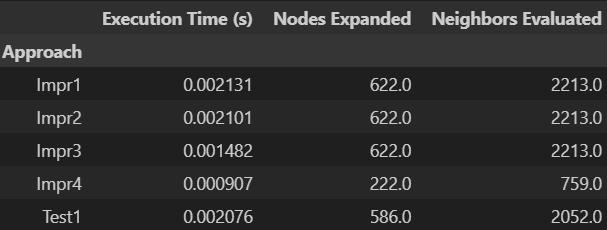
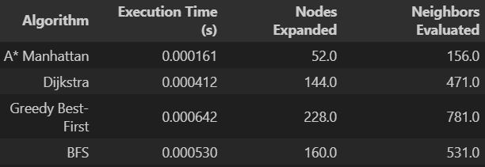
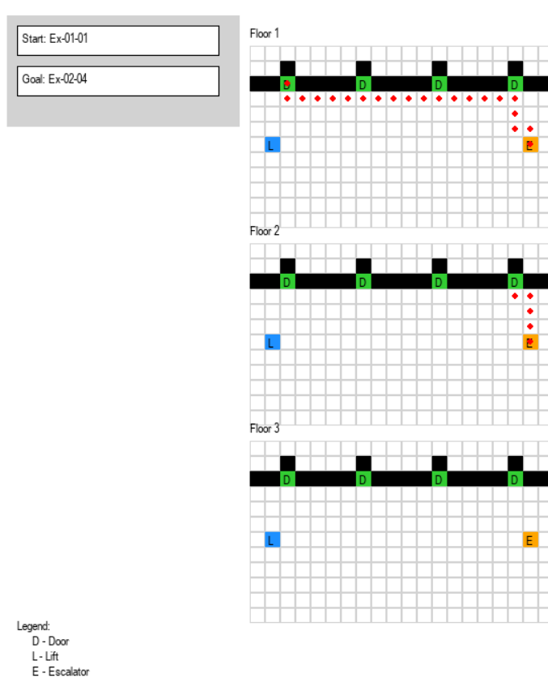

<div align="center">
    
    <h1>Indoor Navigation with Bidirectional A*</h1>
    <h4>Alexi, Aloysius, Bryan, Cavell, Jay, Johnathan</h4>
    <h4>March 23, 2025</h4>
</div>

## Abstract

This project demonstrates a **Bidirectional A\*** pathfinding algorithm for navigating a multi-floor building. It includes both a core algorithm implementation and an interactive **Pygame-based visualization**, where users can choose source and destination points (doors, lifts, or escalators) to view optimal navigation paths.

---

## Features

- **Bidirectional A\*** algorithm for faster pathfinding in complex 2D environments.
- Supports **multiple floors**, with navigation via:
  - **Lifts** (L)
  - **Escalators** (E)
  - **Door** (D) [Only in the visualization]
- Dynamically identifies vertical movement points (lifts/escalators).
- Caching of evaluated neighbours
- **Interactive Pygame GUI**:
    - Select start and goal from dropdowns.
    - Visualize floor-by-floor navigation with legend and color-coded elements.

---

## 📁 Project Structure

- `BiDiAstar_Nav.py`: Main script with the core pathfinding logic and the interactive GUI.
- `Algorithm_Benchmarks.ipynb`: Jupyter Notebook for comparing algorithm performance (includes all our testing and benchmarks).

---

## 🧠 Pathfinding Overview

The algorithm uses a **bidirectional approach**, running two A* searches simultaneously:
- One from the **start node**
- One from the **goal node**

When the searches meet, the path is reconstructed by merging both search trees.

### Grid Symbols:
| Symbol | Meaning     |
|--------|-------------|
| `#`    | Wall        |
| `D`    | Door (Start/Goal) |
| `L`    | Lift        |
| `E`    | Escalator   |

---

## How to Run

1. **Install dependencies**:
   ```bash
   pip install requirements.txt
   ```

2. **Run the visualizer**:
   ```bash
   python BiDiAstar_Nav.py
   ```

3. Use the dropdown to choose a **start** and **goal** point.

4. The shortest path will be drawn through all floors, using lifts and escalators as needed.

---

## 📌 Requirements

**Used in `BiDiAstar_Nav.py`**
```txt
pygame>=2.1.0
```

**Used in `Algorithm_Benchmarks.ipynb`:**
```txt
pandas>=1.3.0     
numpy>=1.21.0     
matplotlib>=3.4.0
```

> 💡 `heapq` is part of the Python Standard Library and does **not** need to be listed here.

## 📊 Benchmarking

To analyze the performance of different pathfinding algorithms (e.g., A*, Dijkstra, Bidirectional A*), check out the notebook `Algorithm_Benchmarks.ipynb`

<div align="center">
    
    <P>Comparisons of various improvements</p>
</div>

<div align="center">
    
    <P>Comparisons of various pathfinding algorithms</p>
</div>

---


## 📸 Demo

<div align="center">
    
    <P>Demo of Minimum Viable Product</p>
</div>

---


